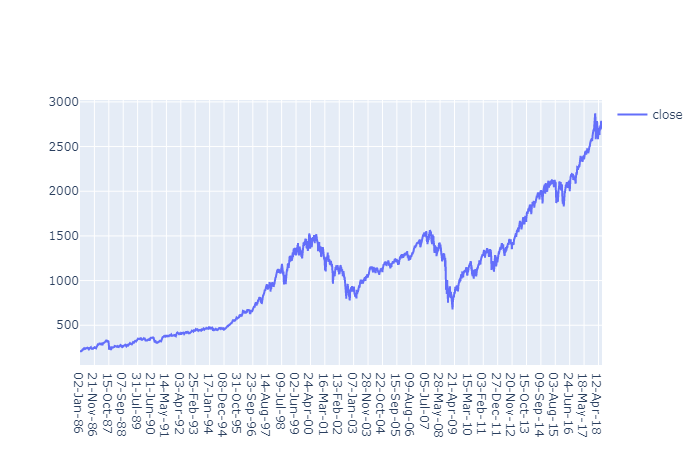
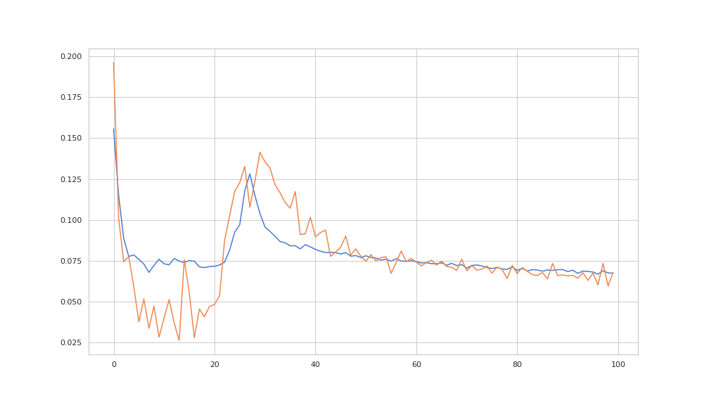
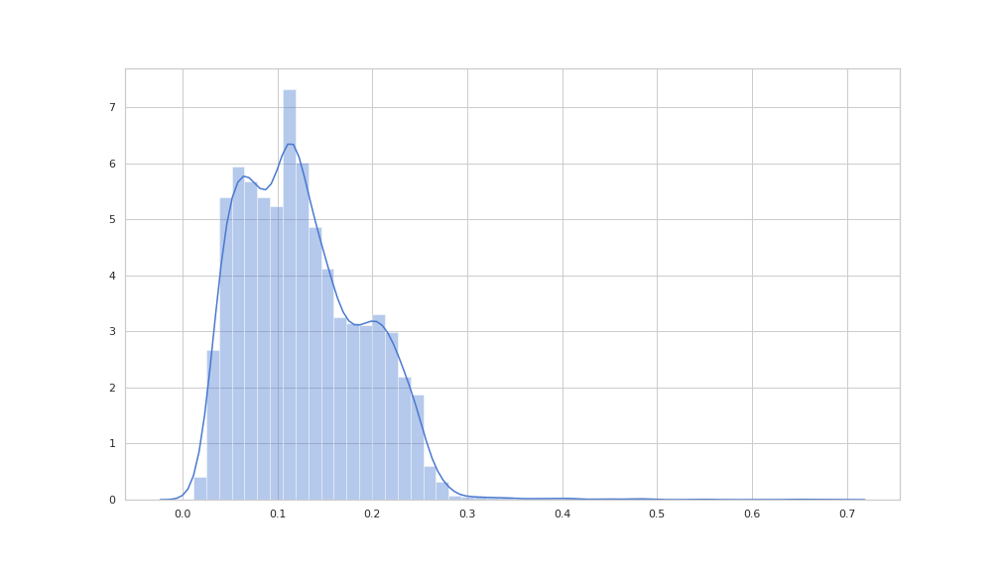

# *Anomly Detection in Time Series With Keras AutoEncoders*

> Threshold = 0.65  
> According to our model mae loss. Beyound that threshold we will detect them as anomly. There appearance is quite significnt.

### *Autoencoders*

In various domains such as, but not limited to, statistics, signal processing, finance, econometrics, manufacturing, networking[disambiguation needed] and data mining, anomaly detection (also outlier detection) is the identification of rare items, events or observations which raise suspicions by differing significantly from the majority of the data. Typically the anomalous items will translate to some kind of problem such as bank fraud, a structural defect, medical problems or errors in a text. Anomalies are also referred to as outliers, novelties, noise, deviations and exceptions.

In particular, in the context of abuse and network intrusion detection, the interesting objects are often not rare objects, but unexpected bursts in activity. This pattern does not adhere to the common statistical definition of an outlier as a rare object, and many outlier detection methods (in particular unsupervised methods) will fail on such data, unless it has been aggregated appropriately. Instead, a cluster analysis algorithm may be able to detect the micro clusters formed by these patterns.

Three broad categories of anomaly detection techniques exist. Unsupervised anomaly detection techniques detect anomalies in an unlabeled test data set under the assumption that the majority of the instances in the data set are normal by looking for instances that seem to fit least to the remainder of the data set. Supervised anomaly detection techniques require a data set that has been labeled as "normal" and "abnormal" and involves training a classifier (the key difference to many other statistical classification problems is the inherent unbalanced nature of outlier detection). Semi-supervised anomaly detection techniques construct a model representing normal behavior from a given normal training data set, and then test the likelihood of a test instance to be generated by the learnt model. 

### *Get Touch With Me*
Connect- [Linkedin](https://linkedin.com/in/rakibhhridoy)  
Website- [RakibHHridoy](https://rakibhhridoy.github.io)